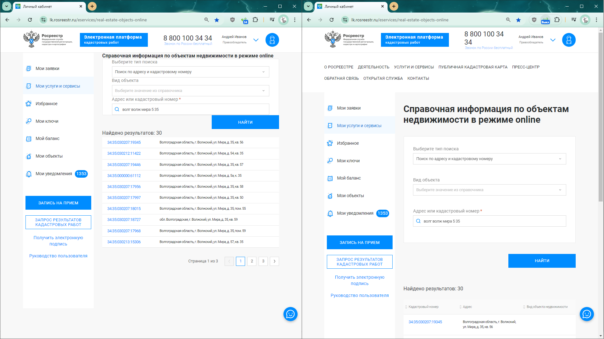
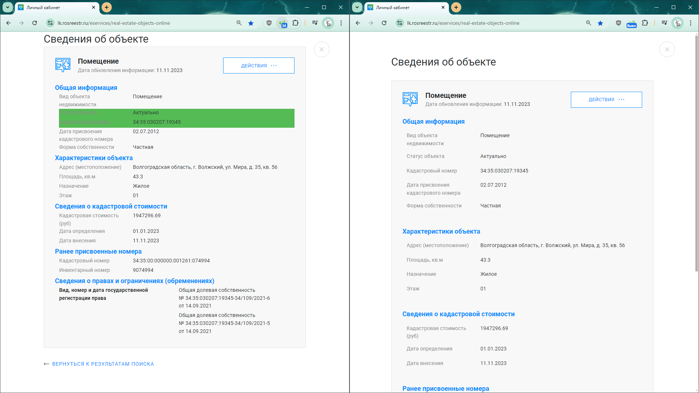
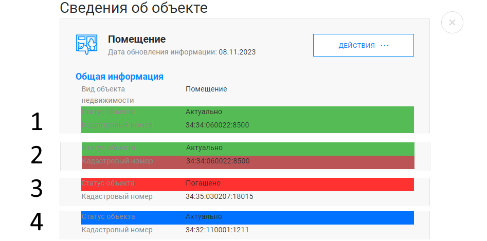
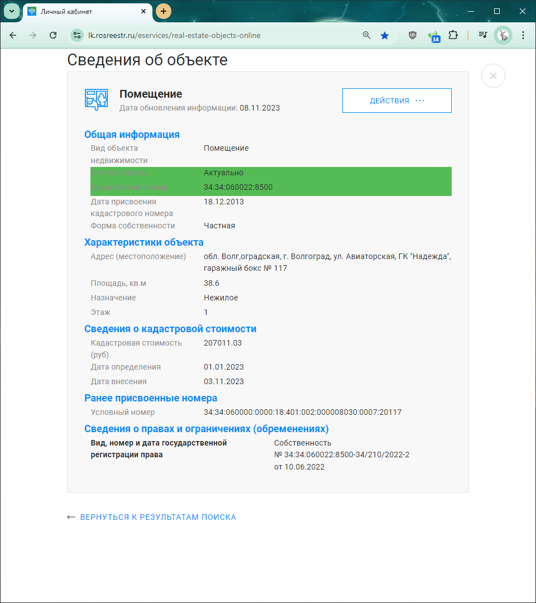
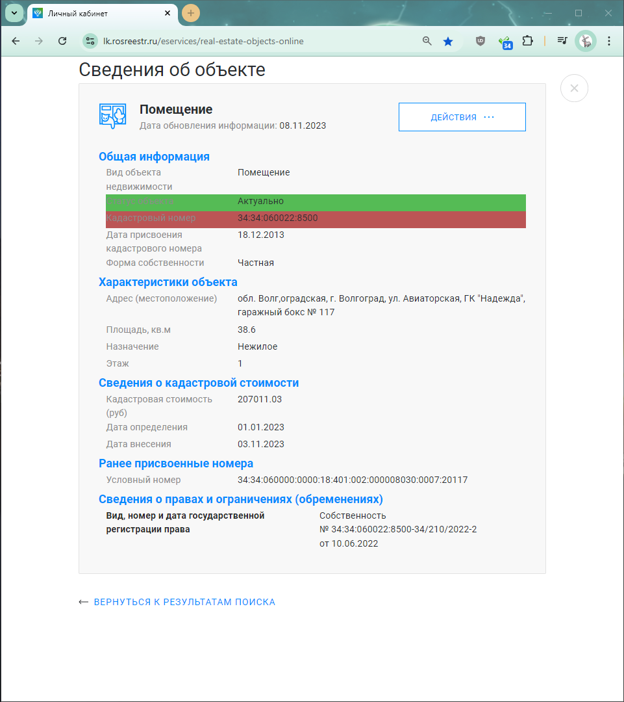
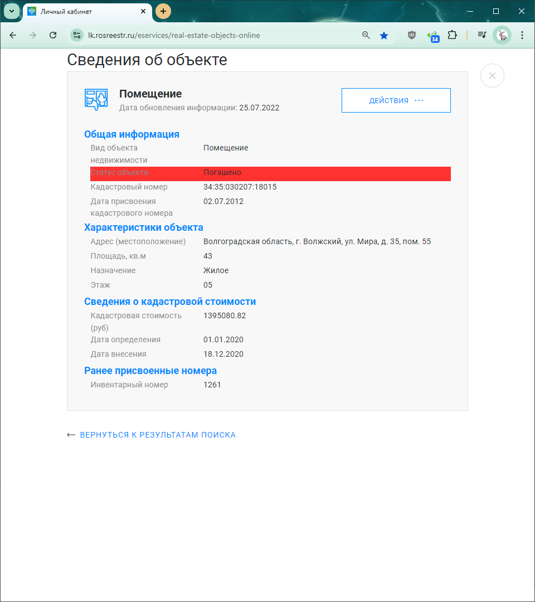

### Установка расширения.

+Скачать все файлы, сохранить в любую удобную папку

+Открыть список расширений chrome://extensions/

+Включить режим разработчика

+Загрузить распакованное расширение - выбрать папку с сохранёнными файлами

### Переключение режима работы

выключено, копирование кадастрового номера, копирование всей информации - переключается циклически Выкл > 34 > i > Выкл и т.д.

### Внешний вид страниц с работающим расширением и без него (в обоих случаях установлен масштаб страницы 90%)

Список найденных объектов

Сведения об объекте

Подсветка

Статус объекта "Актуально" + есть сведения о правах, кадастровый номер скопирован в буфер обмена

Статус объекта "Актуально" + есть сведения о правах, кадастровый номер (или вся информация) не скопирован в буфер обмена, т.к. окно в момент копирование было не в фокусе - достаточно вернуться в это окно и всё будет скопировано ещё раз

Статус объекта "Погашено" 

Статус объекта "Актуально" + нет сведений о правах

### кнопки для быстрого копирования кадастрового номера, сведений о правах и всей информации

### кнопка для быстрой вставки содежимого бучера обмена в поле поиска; если в буфере обмена содержится кадастровый номер с пробелами, они удалются ('_34:35:000000_:1234_' > '34:35:000000:1234')

